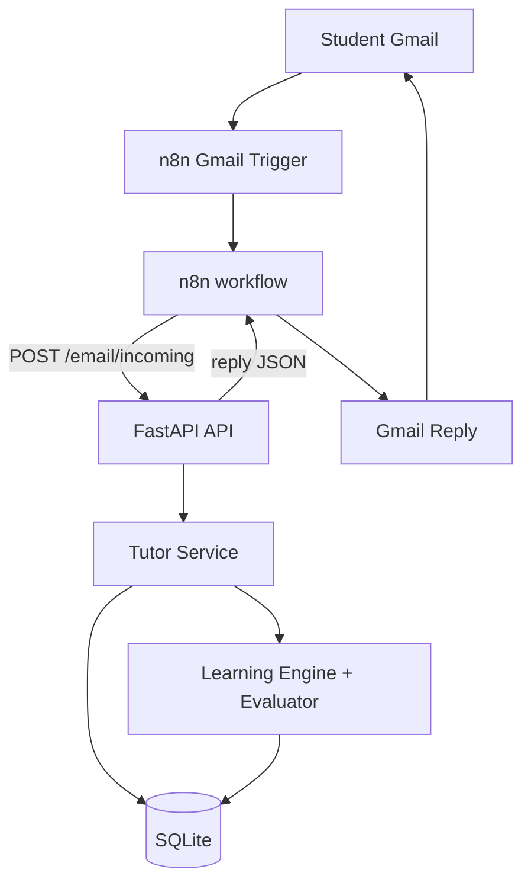
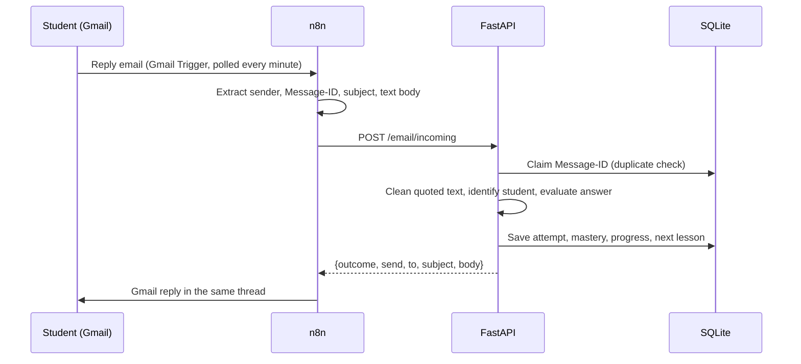
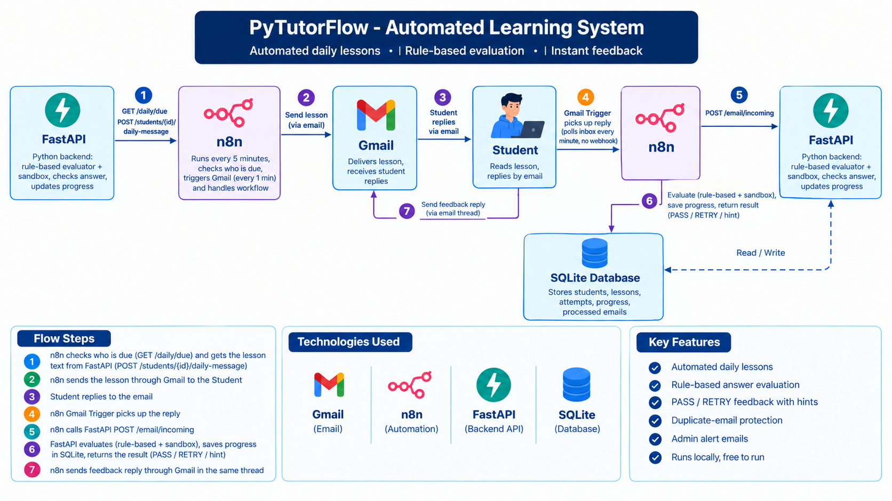
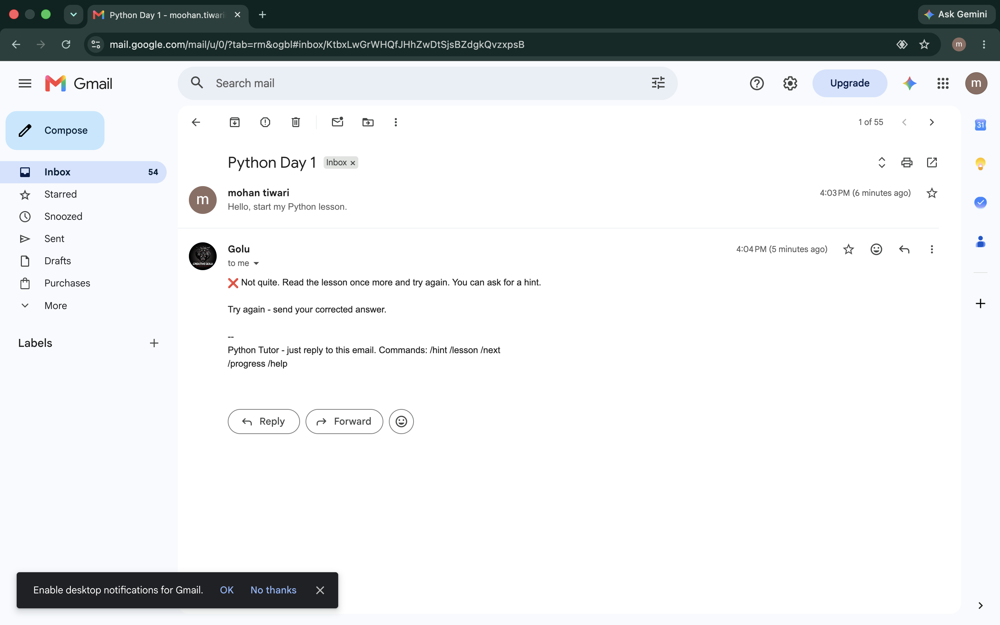
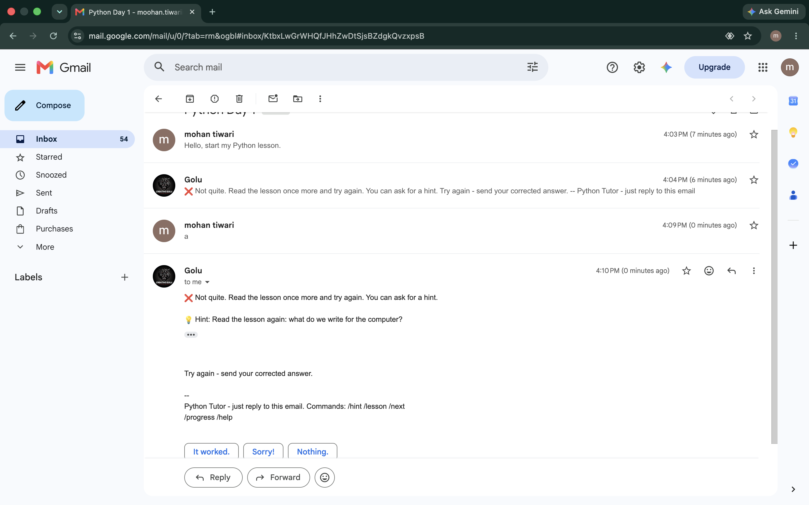
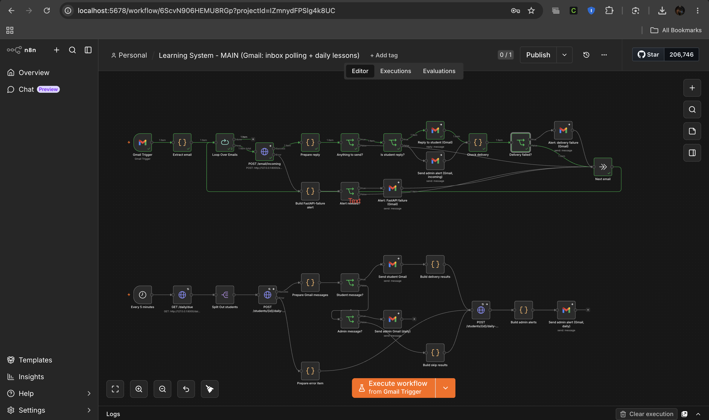
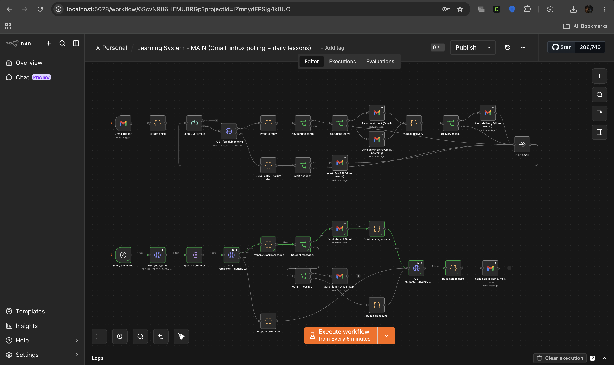
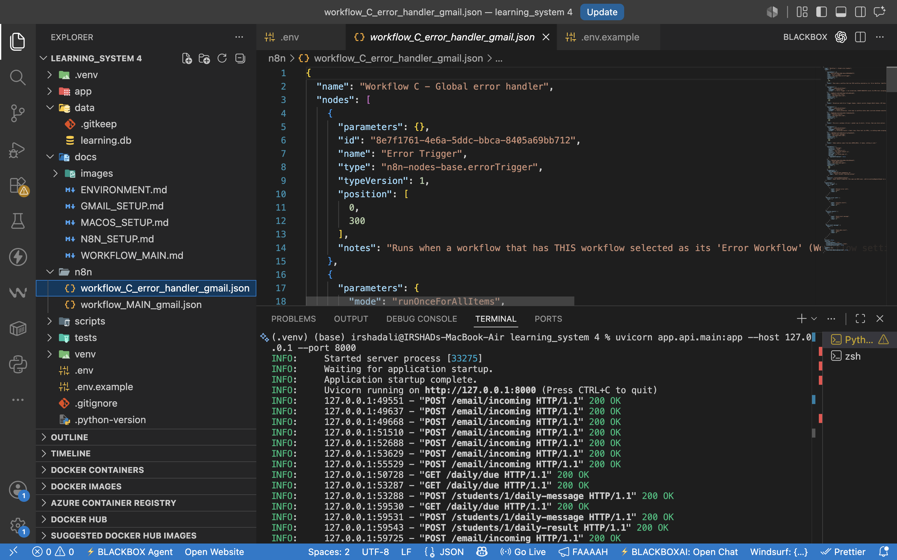

# PyTutorFlow

**Local-first automated Python learning system.** Students learn by email; Gmail, n8n, FastAPI and SQLite do the rest.

```
Gmail  ->  n8n  ->  FastAPI  ->  Learning Engine  ->  SQLite  ->  Gmail Reply
```

    

Self-hosted on your own machine, free to run, no AI APIs and no paid services. Not deployed to any cloud.

## What it is

A small, working automation project: a registered student gets a Python lesson by email, replies with an answer, and receives graded feedback
and the next lesson automatically. n8n is the clock and Gmail plumbing; a FastAPI service holds every learning decision; SQLite remembers progress.

## Problem

Tutoring a beginner by email is repetitive: send the lesson, read the reply, check the answer, write feedback, remember who is on which lesson, and
nudge people who go quiet.

## Solution

PyTutorFlow automates that loop with deterministic, rule-based logic (no AI): scheduled lesson emails, answer checking for quizzes and short Python
programs, hints and retries, mastery tracking, duplicate-email protection and admin alerts.

## Architecture



## Features

- Email-only learning loop: daily lesson, reply in the same thread, automatic feedback. Nothing to install for the student.
- Rule-based evaluation of multiple-choice and Python-code exercises, hints after repeated misses, weak-topic and concept-mastery tracking.
- Progress in SQLite: lesson completion, prerequisites, streaks, daily lesson limit, schema migrations, backup endpoint.
- Duplicate-email protection (each Gmail Message-ID is stored before grading) and duplicate student name/email protection.
- Catch-up delivery if the machine was off at send time; retry then give-up-and-alert on delivery failures; admin alert emails and a global n8n error workflow.
- API protected by an `X-API-Key` header (except `/health`) and bound to `127.0.0.1`.

## Real workflow

**Student replies**

```
Student sends Gmail -> Gmail Trigger -> n8n extracts email -> FastAPI POST /email/incoming
-> tutor engine evaluates answer -> FastAPI returns response -> n8n sends Gmail reply
-> student receives feedback -> progress is updated (in SQLite, during the API call)
```



**Daily lessons**

```
Scheduler (every 5 min) -> GET /daily/due -> Split students -> POST /students/{id}/daily-message
-> Gmail send -> POST /students/{id}/daily-result
```

## Tech stack

Python 3.10+ (3.12 recommended) | FastAPI + Uvicorn | SQLite (built-in `sqlite3`, WAL mode) | n8n (self-hosted via npm) | Gmail through n8n OAuth2 | PyYAML (curriculum) | pytest

## Example student flow

1. Admin: `python -m app add-student "Asha" --email asha@example.com --time 08:00`
2. At 08:00 Asha receives "Python lesson: What is programming?" with a quiz question.
3. She replies in the same thread with a letter, e.g. `b`.
4. She gets feedback in the same thread. A wrong answer gets a retry; repeated misses add a hint.
5. When every exercise is passed the lesson completes. The next lesson ("What is Python?") arrives with the next daily email.
6. Commands (first line of a reply): `/hint`, `/lesson`, `/next`, `/progress`, `/help`.

## Setup

Documented and used on macOS; Linux should work the same way; Windows is untested. Needs Python 3.10+ and Node.js (for n8n).

```bash
git clone <your-repo-url> && cd <repo-folder>
python3 -m venv .venv && source .venv/bin/activate
pip install -r requirements.txt
cp .env.example .env            # fill in the values below
python -m app init              # creates data/learning.db and loads the curriculum
```

## Environment variables

`.env` is git-ignored; `.env.example` lists every option. The important ones:

| Variable | Purpose |
|---|---|
| `API_KEY` | Required. Sent by n8n as `X-API-Key`. Generate: `python3 -c "import secrets; print(secrets.token_urlsafe(32))"` |
| `N8N_ENCRYPTION_KEY` | Required for n8n. Encrypts n8n's stored credentials. Back it up and never change it. |
| `ADMIN_EMAIL` | Receives admin alerts. Empty = no alert emails. |
| `APP_TIMEZONE`, `DEFAULT_SEND_TIME` | Scheduling (defaults `Asia/Kolkata`, `08:00`) |
| `LEARNING_DB_PATH` | SQLite file (default `data/learning.db`) |

Details: [docs/ENVIRONMENT.md](docs/ENVIRONMENT.md). No Gmail password or token lives in this project; Gmail is authorised by OAuth inside n8n.

## Gmail and n8n setup

1. Install and start n8n locally: [docs/N8N_SETUP.md](docs/N8N_SETUP.md).
2. Create a Google Cloud OAuth client (Web application, Gmail API enabled, your tutor address added as a test user, redirect URI
   `http://localhost:5678/rest/oauth2-credential/callback`) and add it in n8n as the *Gmail OAuth2 API* credential.
3. Add a *Header Auth* credential `FastAPI X-API-Key` (header `X-API-Key`, value = your `API_KEY`).
4. Import `n8n/workflow_MAIN_gmail.json` and `n8n/workflow_C_error_handler_gmail.json`, assign the credentials to each node,
   set Workflow C as MAIN's Error Workflow, and activate MAIN.

Full walkthrough: [docs/GMAIL_SETUP.md](docs/GMAIL_SETUP.md), node-by-node: [docs/WORKFLOW_MAIN.md](docs/WORKFLOW_MAIN.md).

## Running locally

```bash
python -m app serve        # FastAPI on http://127.0.0.1:8000  (interactive API docs at /docs)
./scripts/start_n8n.sh     # n8n on http://127.0.0.1:5678
./scripts/smoke_test.sh    # optional: /health and API-key checks against the running API
```

API (all but `/health` need `X-API-Key`): `GET /health`, `POST /email/incoming`, `GET /daily/due`, `POST /students/{id}/daily-message`,
`POST /students/{id}/daily-result`, `GET|POST /admin/students`, `POST /admin/students/{id}/email`, `POST /admin/curriculum/reload`, `POST /admin/backup`.

## CLI usage

```bash
python -m app add-student "Asha" --email asha@example.com --time 08:00   # the ONLY way to create a student
python -m app set-email "Asha" asha@example.com                          # attach/change an email
python -m app students                                                 # progress table
python -m app cli --student "Asha"                                     # try lessons in the terminal
```

`cli` only works with students that already exist (name match ignores case and surrounding spaces). An unknown name creates nothing and prints how
to use `add-student`. Duplicate names and duplicate emails are refused.

## Testing

```bash
python -m pytest -q
```

The suite covers the learning engine, evaluator and sandbox, curriculum loading, migrations, student/email uniqueness, the Gmail daily and reply flows,
and the HTTP API. The n8n workflows are checked only by reading their JSON; they are not covered by automated tests and need a real n8n and Gmail to run.
For an exact, reproducible environment, run `./scripts/freeze_lock.sh` once the tests pass; it writes `requirements.lock.txt`.

## Security limitations

This is a local portfolio project, not a hardened service.

**Code execution is intended for trusted/local learners. It is not a hardened or production-grade sandbox, and not safe for public or multi-tenant use.**

What exists:
- An AST pre-check rejects imports outside an allow-list (math, random, datetime, json, re and similar), a deny-list of names (`open`, `exec`, `eval`,
  `compile`, `__import__`, `getattr`, `setattr`, `globals`, ...) and any `__dunder__` attribute.
- Code runs in a separate `python -I` subprocess, in a temporary directory, with an almost empty environment.
- A hard timeout kills the process; output is capped (default 20 kB) and code length is capped.
- On Linux/macOS only: CPU-time, memory (256 MB address space) and file-size limits through `resource`. On Windows only the timeout and output cap apply.

What does not exist:
- Python builtins are **not** restricted at runtime: protection comes from the static check before execution, which is a deny-list and can be bypassed.
- No container, namespace, seccomp, filesystem or network isolation.

Other limits: the API is for `127.0.0.1` behind one shared API key (do not expose it or n8n to the internet); the sender is taken from the email `From`
header and is not independently verified; there is no HTTPS, multi-user admin or cloud deployment.

## Curriculum scope

Phase 1, beginner foundation: **5 lessons, 10 exercises** (what programming is, what Python is, running programs, `print()`). This is a starter
curriculum that demonstrates the engine, not a complete Python course. Lessons are YAML files and more can be added.

## Project structure

```
app/
  api/          FastAPI app and request/response schemas
  service/      Tutor service: email handling, daily scheduling, admin, reply text
  progress/     Learning engine: lessons, attempts, mastery rules
  evaluator/    Answer evaluation and the code runner (sandbox.py)
  curriculum/   YAML lessons/exercises and mastery rules
  database/     SQLite schema and migrations
  cli.py        Terminal mode for an existing student
n8n/            workflow_MAIN_gmail.json, workflow_C_error_handler_gmail.json
docs/           Gmail, n8n, macOS and environment guides; docs/images for screenshots
scripts/        start_n8n.sh, smoke_test.sh, freeze_lock.sh
tests/          pytest suite
data/           SQLite database (git-ignored)
```


## Screenshots / Demo

### Architecture



### Gmail Lesson



### Gmail Feedback



### n8n Workflow



### n8n Error Handler



### FastAPI Documentation



Verified by hand with a real Gmail account: a student received "What is programming?", replied by email, got automatic feedback, and was moved to "What is Python?".

Verified by hand with a real Gmail account: a student received "What is programming?", replied by email, got automatic feedback, and was moved to "What is Python?".

## Future improvements

- More lessons (variables, conditions, loops, functions) and a short curriculum authoring guide
- Stronger isolation for code execution (container or OS-level sandbox) before any use with untrusted users
- Remove the inactive Telegram compatibility code from the Python package (kept for now because existing tests exercise it)
- Automated tests for the n8n workflows, a CI workflow, and a lightweight admin view


## 👨‍💻 Author

Made by Irshad Ali  
B.Tech CSE (AI & ML) | Web Dev & AI Automation Learner

GitHub: https://github.com/Irshadali1786

---

## 📌 License

MIT License

---


## 🚀 Getting Started

### Clone the Repository

```bash
git clone https://github.com/Irshadali1786/PyTutorFlow.git
cd ML_Visualizer


